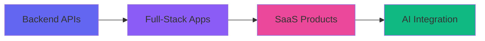

<div align="center">
  
  <!-- Dynamic Header -->

  <!-- Typing Animation -->
  
  
  <br/>
  
  <!-- Social Badges -->
  <p>
    <a href="https://www.linkedin.com/in/abhishek-acharya-5b187b283/">
      
    </a>
    <a href="mailto:abhsheake@gmail.com">
      
    </a>
    <a href="https://github.com/javascript1415">
      
    </a>
  </p>
  
  <!-- Profile Stats -->
  <p>
    
    
    
  </p>

</div>

---

## 👨‍💻 About Me

```typescript
const abhishekAcharya = {
    title: "Full-Stack Developer",
    location: "Kathmandu, Nepal 🇳🇵",
    company: "Available for Hire",
    
    currentlyWorking: {
        project: "Film Finance Management SaaS",
        role: "Lead Developer",
        stack: ["Next.js", "TypeScript", "PostgreSQL", "Express"]
    },
    
    expertise: {
        backend: ["Django", "Django REST Framework", "Node.js", "Express"],
        frontend: ["Next.js", "React", "TypeScript", "TailwindCSS"],
        databases: ["PostgreSQL", "Prisma ORM"],
        architecture: ["Multi-tenant SaaS", "RESTful APIs", "Microservices"]
    },
    
    currentlyLearning: ["Advanced Node.js Patterns", "System Design", "AI Integration"],
    
    interests: ["Web Development", "SaaS Products", "AI/ML", "Open Source"],
    
    funFact: "I turn coffee into production-ready code ☕ → 💻",
    
    workingHours: "Available for remote opportunities worldwide 🌍"
};
```

<div align="center">

### 🎯 **Specializations**

</div>

<table align="center">
<tr>
<td align="center" width="33%">

**🔧 Backend Engineering**

Scalable REST APIs  
Database Design  
Authentication & Security

</td>
<td align="center" width="33%">

**🎨 Frontend Development**

Responsive Design  
Modern UI/UX  
Performance Optimization

</td>
<td align="center" width="33%">

**☁️ Full-Stack Solutions**

SaaS Architecture  
Multi-tenant Systems  
CI/CD Pipelines

</td>
</tr>
</table>

---

## 🛠️ Technology Stack

<div align="center">

### **Core Technologies**

<table>
<tr>
<td align="center" width="20%">

<br><b>Python</b>
</td>
<td align="center" width="20%">

<br><b>Django</b>
</td>
<td align="center" width="20%">

<br><b>Next.js</b>
</td>
<td align="center" width="20%">

<br><b>TypeScript</b>
</td>
<td align="center" width="20%">

<br><b>PostgreSQL</b>
</td>
</tr>
</table>

### **Frontend Development**


### **Backend Development**


### **Database & ORM**


### **Tools & DevOps**


</div>

---

## 📊 GitHub Analytics

<div align="center">
  

  

</div>

---

## 🚀 Featured Projects

<div align="center">

### 🎬 **Film Finance Management SaaS**
*Multi-tenant Production Budgeting & Payment Platform*

</div>

```typescript
Project Highlights:
├── 🏗️ Multi-tenant SaaS Architecture
├── 💰 Budget Management & Quotation System
├── 📊 Waterfall Analysis & Financial Forecasting
├── 📄 Dynamic PDF Generation
├── 🔐 Role-based Access Control (RBAC)
└── 💳 Payment Scheduling & Tracking
```

**Tech Stack:** `Next.js` `TypeScript` `PostgreSQL` `Prisma` `Express` `TailwindCSS`

**Status:** 🟢 Active Development | **Role:** Lead Developer

<div align="center">
  
  [](#)
  
</div>

---

<div align="center">

### 🤖 **AI-Powered Solutions**

</div>

<table align="center">
<tr>
<td width="50%">

#### **Nepal Telecom AI Chatbot**
Customer service automation with AI/LLM integration

**Tech:** `Python` `AI/ML` `NLP`

</td>
<td width="50%">

#### **AI Integration Projects**
Building intelligent features for web applications

**Tech:** `OpenAI` `LangChain` `APIs`

</td>
</tr>
</table>

---

<div align="center">

### 🛒 **E-Commerce & Business Solutions**

</div>

<table align="center">
<tr>
<td align="center" width="33%">

**🏬 Full-Stack E-Commerce**

Complete platform with cart, payments & order management

[](https://github.com/javascript1415/land-renting-ststem)

`Django` `PostgreSQL` `REST API`

</td>
<td align="center" width="33%">

**🔐 Password Manager**

Secure credential storage with encryption

[](https://github.com/javascript1415/password-manager)

`Python` `Encryption` `Django`

</td>
<td align="center" width="33%">

**💰 Daily Spend Tracker**

Personal finance management app

[](https://github.com/javascript1415/daily_spend_bill)

`Django` `Charts` `Analytics`

</td>
</tr>
</table>

---

<div align="center">

### 💼 **Productivity & Utility Applications**

</div>

<table align="center">
<tr>
<td align="center" width="50%">

**✅ Todo Application**

Task management with priorities and deadlines

[](https://github.com/javascript1415/todo_django)

`Django` `REST API` `CRUD`

</td>
<td align="center" width="50%">

**🔑 Custom Authentication**

Secure user authentication system

[](https://github.com/javascript1415/customauth)

`Django` `JWT` `OAuth`

</td>
</tr>
</table>

---

## 💼 Professional Experience

<div align="center">



</div>

**Key Achievements:**
- 🎯 Built production-grade multi-tenant SaaS applications
- 🤖 Integrated AI/LLM capabilities into customer-facing products
- 🔧 Designed and implemented scalable REST APIs
- 📊 Developed complex financial management systems
- 🚀 Delivered multiple e-commerce and business automation solutions

---

## 📈 Contribution Activity

<div align="center">
  
  

</div>

---

## 🎯 Current Goals

<table align="center">
<tr>
<td width="33%" align="center">

### 🚀 2026 Objectives

- Launch Film Finance SaaS
- Contribute to Open Source
- Master System Design
- Build AI-powered tools

</td>
<td width="33%" align="center">

### 📚 Learning Path

- Advanced Django Rest Framework
- Microservices Architecture
- DevOps & CI/CD
- Machine Learning Basics

</td>
<td width="33%" align="center">

### 💡 Looking For

- Remote opportunities
- Exciting collaborations
- Innovative projects
- Mentorship in scaling

</td>
</tr>
</table>

---

## 📫 Let's Connect

<div align="center">

### **I'm always interested in hearing about new projects and opportunities!**

<p>
  <a href="https://www.linkedin.com/in/abhishek-acharya-5b187b283/">
    
  </a>
  <a href="mailto:abhsheake@gmail.com">
    
  </a>
  <a href="https://github.com/javascript1415">
    
  </a>
  <a href="https://instagram.com/acharyabhishek48">
    
  </a>
</p>

---

### 💬 **Let's build something amazing together!**

**Available for:**
- Full-time positions
- Freelance projects
- Open source collaborations
- Technical consulting

</div>

---

<div align="center">
  
  
  
  <sub>⭐ From [javascript1415](https://github.com/javascript1415) with ❤️</sub>
  
  **"Code is like humor. When you have to explain it, it's bad." – Cory House**

</div>
